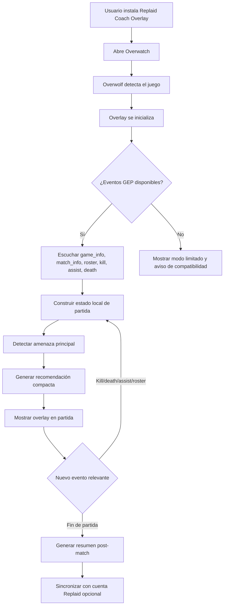
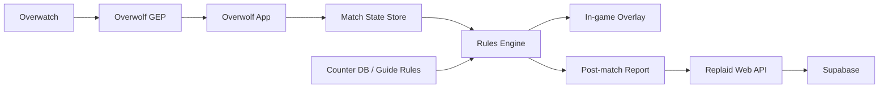

# Replaid Coach Overlay

Documento provisional para desarrollar una herramienta automática de coaching en partida para Overwatch usando Overwolf.

## Objetivo

Crear un overlay contextual que ayude al jugador a tomar mejores decisiones durante la partida sin leer memoria, interceptar red, modificar el cliente ni automatizar inputs.

La herramienta debe comportarse como un coach: interpreta eventos permitidos, resume el estado de la partida y recomienda la siguiente decisión útil.

## Posicionamiento

Nombre provisional: **Replaid Coach Overlay**

Promesa:

- "Qué está pasando en esta partida."
- "Qué amenaza te está ganando."
- "Qué cambio o adaptación tiene más sentido."
- "Qué ultimate conviene guardar, forzar o usar en la próxima pelea."

No prometer:

- Cooldowns enemigos exactos.
- Ultimates enemigas exactas si Overwolf no las expone.
- Información oculta que el jugador no pueda conocer.
- Automatización de acciones dentro del juego.

## Principio de seguridad

La regla de producto es: **solo datos autorizados, inferencias prudentes y recomendaciones explicables**.

Permitido:

- Eventos oficiales de Overwolf Game Events Provider.
- Estado de partida, mapa, roster y eventos de kills/deaths/assists cuando estén disponibles.
- Inferencias estadísticas locales.
- Configuración manual del jugador.
- Reglas de composición, mapa, counters y win conditions mantenidas por Replaid Lab.

No permitido:

- Leer memoria del proceso de Overwatch.
- Hookear el cliente del juego.
- Capturar paquetes o tráfico de red.
- Automatizar teclado, ratón o inputs.
- Extraer información que el juego no muestra ni Overwolf expone.
- OCR continuo del HUD para deducir cooldowns o ultimates si eso no está explícitamente permitido.

Fuentes de referencia:

- Overwolf Overwatch Game Events: https://dev.overwolf.com/ow-native/live-game-data-gep/supported-games/overwatch/
- Overwolf games.events API: https://dev.overwolf.com/ow-native/reference/games/events/
- Blizzard Anti-Cheating Agreement: https://www.blizzard.com/en-us/legal/simple/cd5930c0-2784-420c-a23d-1e0d6ff8599b/anti-cheating-agreement
- Blizzard EULA: https://www.blizzard.com/en-us/legal/08b946df-660a-40e4-a072-1fbde65173b1/blizzard-end-user-license-agreement

## Datos automáticos disponibles

Según la documentación pública de Overwolf para Overwatch, las features relevantes son:

- `game_info`
- `match_info`
- `kill`
- `assist`
- `death`
- `roster`

Eventos y señales iniciales:

- La partida empieza o termina.
- El overlay puede detectar información de match si Overwolf la expone.
- Eliminaciones del jugador.
- Asistencias del jugador.
- Muertes del jugador.
- Roster de jugadores/equipos cuando esté disponible.
- Cambios de estado del proveedor de eventos.

La primera versión debe diseñarse para degradar con elegancia si una feature no está disponible.

## Flujo automático de usuario



## Experiencia en partida

El overlay debe ser compacto y poco invasivo.

Panel principal:

- Amenaza principal.
- Recomendación de counter o adaptación.
- Estado de pelea.
- Recomendación de ultimate.

Ejemplos:

- "Tracer está castigando backline. Si juegas support, prioriza Brigitte/Kiriko o juega más cerca de peel."
- "Dos muertes rápidas: fight perdida. Guarda ultimate salvo que puedas cortar captura."
- "Vuestro equipo ganó primera kill. No inviertas segunda ultimate."
- "D.Va está dominando high ground. Considera Zarya, Mei, Symmetra o jugar más agrupado."

## Motor de decisión

La versión inicial debe ser un motor local de reglas, no IA generativa en tiempo real.

Entradas:

- Rol del jugador.
- Héroe del jugador si se puede conocer de forma autorizada o por selección manual inicial.
- Mapa/modo si está disponible.
- Roster y composición inferida.
- Kills, deaths, assists y timing.
- Historial reciente de amenazas.
- Base de datos de counters y planes de pelea.

Salidas:

- `primaryThreat`
- `fightState`
- `recommendedSwap`
- `playstyleAdjustment`
- `ultimateAdvice`
- `confidence`
- `reason`

Ejemplo de salida:

```json
{
  "primaryThreat": "Tracer",
  "fightState": "lost",
  "recommendedSwap": "Brigitte",
  "playstyleAdjustment": "Juega cerca de tu segundo support y guarda Whip Shot para cortar entrada.",
  "ultimateAdvice": "Guarda Rally para la próxima pelea; esta ya está perdida.",
  "confidence": 0.72,
  "reason": "El jugador murió dos veces en menos de tres peleas y el kill feed apunta a dive sobre backline."
}
```

## Estados de pelea

Estados mínimos:

- `neutral`: no hay ventaja clara.
- `advantage`: tu equipo consiguió la primera baja o tiene ventaja numérica.
- `danger`: el rival consiguió primera baja o tu backline está cayendo.
- `lost`: dos o más bajas sin trade útil.
- `won`: pelea ganada o rival limpiado.
- `reset`: recomendar no invertir recursos y agruparse.

Reglas base:

- Si tu equipo pierde dos jugadores sin trade, recomendar guardar ultimates.
- Si tu equipo consigue primera kill y mantiene ventaja, recomendar no sobreinvertir.
- Si el rival usa una ultimate fuerte y tu equipo sobrevive, recomendar castigo o counter-engage.
- Si una amenaza mata repetidamente al mismo rol, subir prioridad de counter.

## Recomendaciones de ultimate

La app no debe afirmar ultimates enemigas exactas si no tiene datos oficiales.

Sí puede recomendar:

- "Guarda defensiva si el rival tiene combo probable."
- "No uses ultimate si la pelea ya está ganada."
- "Usa ultimate para iniciar si vuestro equipo necesita romper choke."
- "Fuerza cooldowns antes de invertir ultimate."

La recomendación debe mostrar incertidumbre cuando aplique:

- "Probablemente conviene guardar..."
- "Si el rival no ha usado Grav en varias peleas, juega como si pudiera tenerla."
- "No hay datos suficientes para una recomendación fuerte."

## Arquitectura MVP



Componentes:

- **Overwolf shell**: manifiesto, permisos, ventanas y lifecycle.
- **GEP adapter**: normaliza eventos de Overwolf.
- **Match state store**: estado local de partida.
- **Rules engine**: reglas de counters, pelea y ultimates.
- **Overlay UI**: panel compacto en partida.
- **Post-match report**: resumen opcional.
- **Replaid API**: sincronización con cuenta, guías y reglas remotas.
- **Supabase**: almacenamiento de reglas, changelog, feedback y reportes.

## Roadmap

### Fase 0: Validación técnica

- Crear app Overwolf mínima.
- Confirmar eventos reales disponibles en Overwatch.
- Loguear `game_info`, `match_info`, `roster`, `kill`, `assist`, `death`.
- Comprobar comportamiento por modo de pantalla y hotkeys.

### Fase 1: Overlay local

- Panel compacto.
- Estado de pelea básico.
- Recomendaciones por muertes repetidas.
- Base local de counters.
- Sin login y sin backend obligatorio.

### Fase 2: Replaid sync

- Login opcional.
- Guardar post-match reports.
- Relacionar recomendaciones con guías existentes.
- Actualizar reglas desde Supabase.

### Fase 3: Publicación

- Landing oficial en Replaid Lab.
- Página de privacidad.
- Changelog.
- Instalador/enlace oficial de Overwolf.
- Revisión con Overwolf antes de distribución pública.

## Landing oficial

La web debe ser el punto de confianza:

- `/overlay` o `/replaid-coach`
- Descarga oficial.
- Explicación de seguridad.
- "Qué hace" y "qué no hace".
- Estado de compatibilidad.
- Changelog.
- Guía de instalación.
- Política de privacidad.
- Enlace a soporte.

## Métricas de éxito

- El usuario entiende la recomendación en menos de 2 segundos.
- El overlay no tapa información importante del juego.
- Las recomendaciones son accionables en la próxima pelea.
- La app funciona aunque falten algunos eventos.
- No hay claims de información exacta no disponible.
- No hay automatización de inputs.

## Preguntas abiertas

- ¿Overwolf expone héroe propio/enemigo de forma fiable en roster o solo jugadores?
- ¿El kill feed incluye héroe atacante/víctima de forma consistente?
- ¿Qué features se mantienen activas en ranked?
- ¿Qué revisión exige Overwolf para una app de coaching en Overwatch?
- ¿Queremos que el primer MVP sea solo Windows/Overwolf o también una web companion para reglas y testing?

## Decisión actual

Desarrollar directamente en Overwolf, con un MVP automático pero conservador:

1. Escuchar eventos oficiales.
2. Mantener estado local.
3. Recomendar con reglas explicables.
4. Mostrar incertidumbre cuando falten datos.
5. Usar Replaid Lab como sitio oficial de descarga, documentación y confianza.
